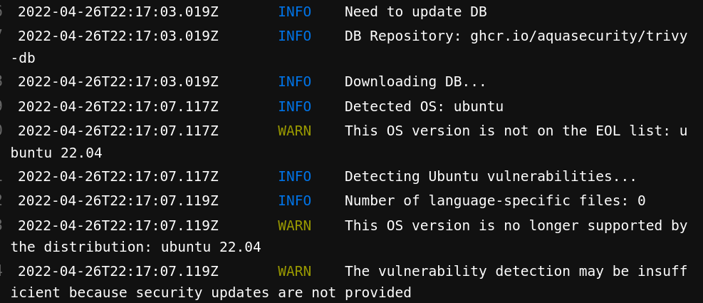

# Test repo for unknown readers

## Part 1: litecoin 
It contains:
- A container manifest (dockerfile) from ubuntu with litecoind (shasum checked).

  I use a build step in order to keep the main image cleaned.

  The scanning results are is `./container` subfolders.
- A statfulset manifest for deployment purpose.

  this statefulset refers to the image build form the Dockerfile and pushed to my dockerhub registry for convenience.

- A pipeline manifest gitlab-ci.yaml.

  The gitlab-ci manifest has been copied from one of my last year projects https://gitlab.com/coinsmaster/common/containers/docker-buildx.

  I can provide access upon request.

  One container image `buildx` has this docker file 
```Dockerfile
  FROM docker:latest
  ARG BUILDX_VER=0.5.1
  RUN mkdir -p /root/.docker/cli-plugins && \
      wget -qO ~/.docker/cli-plugins/docker-buildx \
      https://github.com/docker/buildx/releases/download/v${BUILDX_VER}/buildx-v${BUILDX_VER}.linux-amd64 && \
      chmod +x /root/.docker/cli-plugins/docker-buildx
```


Trivy scan :




## Part 2: Text manipulation

A show case between bash (script) and go (code)
[more details here](./text-manipulation/Readme.md)


## Part 3: Therefore IAM
AWS role & policy showcase with Terraform
[more details here](./iam-management/Readme.md)

